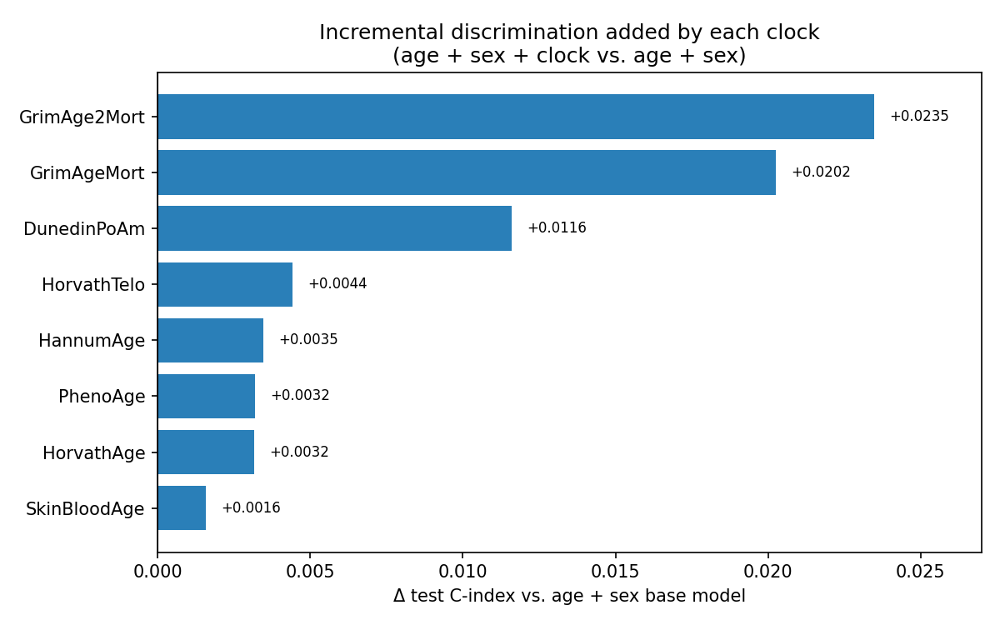
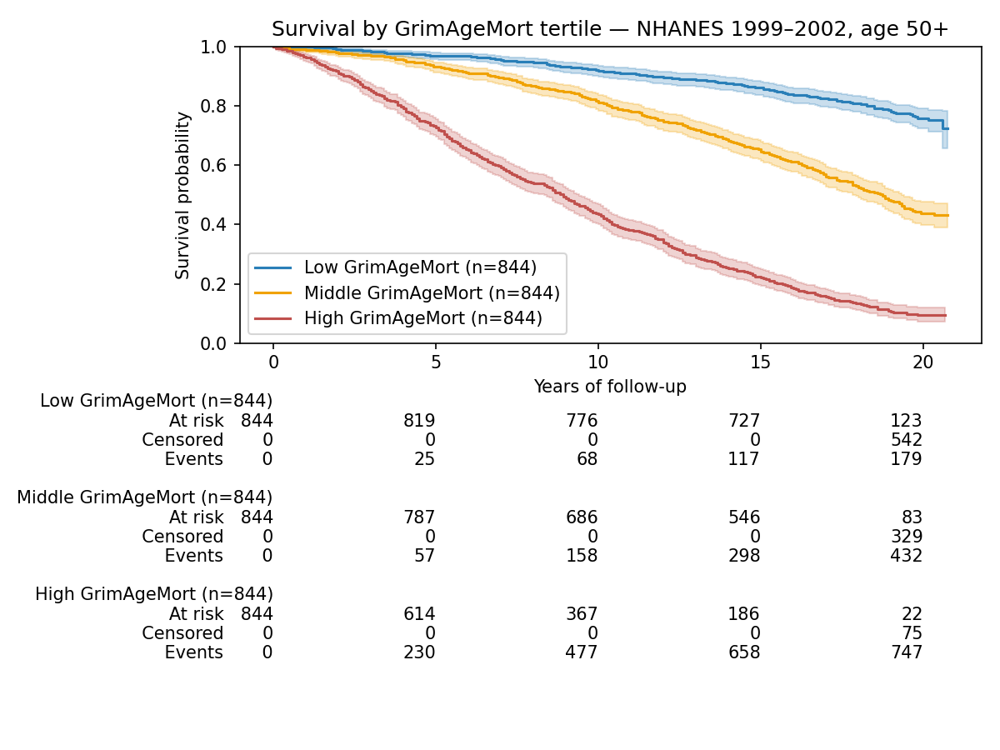

# NHANES Epigenetic Clock Mortality Validation

A small, reproducible pipeline that asks one question with public data:

> **Do DNA-methylation "aging clocks" predict death better than chronological age and sex alone?**

It links eight epigenetic clocks measured on NHANES 1999–2002 participants
(aged 50+) to ~17–20 years of mortality follow-up from the NCHS public-use
Linked Mortality Files, fits Cox proportional-hazards models, and measures how
much each clock improves out-of-sample discrimination (test C-index) over a
plain age + sex baseline.

**Cohort:** n = 2,532 eligible participants aged 50+ with both DNAm biomarkers
and mortality linkage. 1,361 deaths (53.8%), median follow-up 17.1 years.

## Headline result

| | C-index (test) | Δ vs. age+sex | HR per SD (95% CI) | p |
|---|---|---|---|---|
| Age + sex (baseline) | 0.746 | — | — | — |
| + **GrimAge2Mort** | **0.769** | **+0.0235** | 2.06 (1.84–2.30) | 2.5e-36 |
| + GrimAgeMort | 0.766 | +0.0202 | 2.09 (1.86–2.37) | 7.0e-33 |
| + DunedinPoAm | 0.757 | +0.0116 | 1.36 (1.27–1.45) | 1.2e-20 |
| + 5 age-trained clocks | 0.747–0.750 | +0.0016 … +0.0044 | — | — |

Mortality-trained clocks (GrimAge2, GrimAge) carry real, highly significant
signal beyond age and sex, but the absolute discrimination gain is modest
(≤0.024 C-index). Full numbers in [`results/cindex_comparison.csv`](results/cindex_comparison.csv)
and [`RESULTS.md`](RESULTS.md).




## Pipeline (four steps)

```
download  →  verify  →  build_cohort  →  analysis
```

1. **download** (`src/download.py`) — documents the exact data sources and
   validates that the required raw files are present in `data/raw/`.
2. **verify** (`src/verify_variables.py`) — loads the DNAm files and confirms
   the clock column names/labels and that `SEQN`/`WTDN4YR` exist.
3. **build_cohort** (`src/build_cohort.py`) — merges DNAm + demographics +
   mortality on `SEQN`, applies explicit eligibility filters, constructs
   survival variables (`time_years`, `event`), z-scores predictors, and writes
   a stratified 70/30 train/test split (`random_state=42`).
4. **analysis** (`src/analysis.py`) — fits Cox models on the train split,
   evaluates Harrell's C-index on the held-out test split, checks the
   proportional-hazards assumption, and writes the results table and figures.

## Run it (one command)

```bash
python -m venv venv && source venv/bin/activate
pip install -r requirements.txt

# place raw NHANES files in data/raw/ first (see Data sources below), then:
python run_all.py        # or:  make all
```

Outputs:
- `results/cindex_comparison.csv` — per-clock C-index, Δ, HR, 95% CI, p
- `results/ph_assumption_check.txt` — PH diagnostics for base + best model
- `figures/incremental_cindex.png`, `figures/km_by_grimage_tertile.png`

Raw NHANES files are **not** committed (NCHS does not permit redistribution,
and the mortality files require agreeing to a data-use agreement). The derived
`analytic_cohort.csv` is also not committed — it is regenerated from the raw
files. The small, deterministic `data/processed/train_test_split.json` is kept
for exact reproducibility, but `run_all.py` regenerates an identical split from
seed 42 if it is absent.

## Data sources (exact URLs used)

**NHANES DNA Methylation Epigenetic Biomarkers** (combined 1999–2002 cycles)
→ `data/raw/dnmepi.sas7bdat`
`https://wwwn.cdc.gov/nchs/data/nhanes/dnam/dnmepi.sas7bdat`
(landing page: `https://wwwn.cdc.gov/nchs/nhanes/dnam/`)

**NHANES Demographics**
- 1999–2000 → `data/raw/DEMO_1999.xpt` —
  `https://wwwn.cdc.gov/Nchs/Data/Nhanes/Public/1999/DataFiles/DEMO.xpt`
- 2001–2002 → `data/raw/DEMO_2001.xpt` —
  `https://wwwn.cdc.gov/Nchs/Data/Nhanes/Public/2001/DataFiles/DEMO_B.xpt`

**NCHS Linked Mortality Files (public-use, 2019 linkage)**
- 1999–2000 → `data/raw/NHANES_1999_2000_MORT_2019_PUBLIC.dat`
- 2001–2002 → `data/raw/NHANES_2001_2002_MORT_2019_PUBLIC.dat`
- `https://ftp.cdc.gov/pub/Health_Statistics/NCHS/datalinkage/linked_mortality/`
  (info: `https://www.cdc.gov/nchs/data-linkage/mortality-public.htm`)

Clocks used (verified column names): `HorvathAge`, `HannumAge`,
`SkinBloodAge`, `PhenoAge`, `GrimAgeMort`, `GrimAge2Mort`, `DunedinPoAm`,
`HorvathTelo`. Key variables: `SEQN`, `RIDAGEYR`, `RIAGENDR`, `MORTSTAT`,
`PERMTH_EXM`, `ELIGSTAT`.

## Limitations

- **Unweighted.** These models ignore the NHANES complex survey design, so the
  estimates are **not nationally representative** — they describe this analytic
  sample only. The design variables (`WTDN4YR`, `SDMVPSU`, `SDMVSTRA`) are kept
  in the cohort so anyone wanting survey-weighted estimates can produce them.
- **Public-use mortality file.** Follow-up time and cause of death are
  intentionally perturbed in the public-use Linked Mortality Files to protect
  confidentiality; the restricted-use files are more precise.
- **Single cohort, no external validation.** Train/test are two splits of the
  same NHANES sample. There is no replication in an independent cohort, so the
  C-index gains should be read as in-sample-cohort, not externally validated.
- **Proportional hazards.** The age + sex baseline satisfies PH, but in the
  best clock model both age and the clock show mild PH violations (large n
  makes the test sensitive). These are reported, not corrected away.
- **Discrimination only.** This validates ranking (C-index) and hazard ratios,
  not calibration or absolute risk.

## Repository layout

```
.
├── run_all.py            # one-command pipeline
├── Makefile              # make all / install / build / analysis / clean
├── src/
│   ├── download.py       # document sources + validate raw files
│   ├── verify_variables.py
│   ├── build_cohort.py   # merge + filter + split
│   └── analysis.py       # Cox models, C-index, PH checks, figures
├── data/
│   ├── raw/              # NHANES files (not committed; download yourself)
│   └── processed/        # train_test_split.json (cohort CSV is gitignored)
├── results/              # cindex_comparison.csv, ph_assumption_check.txt
├── figures/              # incremental_cindex.png, km_by_grimage_tertile.png
├── RESULTS.md
├── CITATION.md
└── LICENSE
```

## License & credit

Code is MIT-licensed ([`LICENSE`](LICENSE)). The data is produced by the U.S.
National Center for Health Statistics and is subject to NCHS terms of use;
please credit NHANES and the NCHS Linked Mortality Files — see
[`CITATION.md`](CITATION.md).
